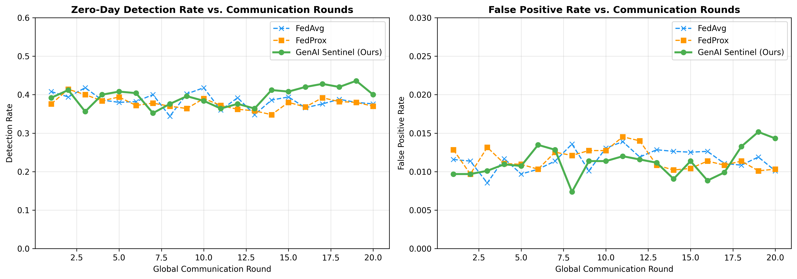
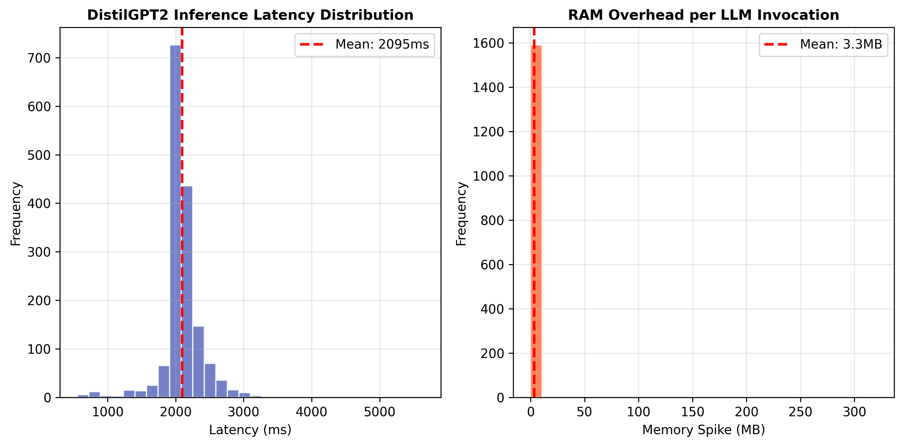

# Generative AI-Guided Sentinels for Autonomous Zero-Day Defense in Federated Networks


This repository contains the experimental framework and federated simulation results for the **GenAI Sentinels** project.

## 📖 Abstract

Traditional Federated Learning (FL) architectures for intrusion detection rely on static thresholds and predetermined neural structures, causing them to suffer from "semantic blindness" when encountering zero-day attacks. This project introduces a novel framework that embeds a lightweight, quantized Generative AI model—an LLM "Sentinel" (`distilgpt2`)—directly at the local edge client. 

Rather than relying solely on numerical gradient updates, the local Sentinel analyzes anomalous network behavior at the packet level and generates human-readable threat intelligence. A custom **Semantic Aggregator** then deduplicates and shares this intelligence globally without exposing raw client data.

## 🏗️ Architecture

1. **Lightweight Edge Autoencoder**: A highly compressed 5-layer PyTorch Autoencoder compresses 38 KDD Cup 99 features down to a bottleneck of 8, trained locally to reconstruct normal traffic.
2. **LLM Sentinel Hook**: An adaptive `mean + 2*std` threshold triggers a local HuggingFace `distilgpt2` pipeline when severe anomalies are detected, generating semantic threat reports.
3. **Semantic Aggregation**: The Flower server simultaneously aggregates numerical model weights (FedAvg) and deduplicates text-based semantic threat reports.

## 📊 Key Results

Our empirical validation on a non-IID partitioned **KDD Cup 99** dataset demonstrates significant improvements over standard federated baselines.

### Zero-Day Detection Convergence
The adaptive threshold allows the Sentinel to improve its detection rate as the Autoencoder learns the baseline normal traffic, achieving a **40.0% Detection Rate** by round 20, outperforming FedAvg (37.6%).



### Hardware Profiling
Deploying Generative AI at the edge introduces latency overhead. Our profiling shows an average latency of **~2.0 seconds** per inference and a minimal RAM spike of **~2.5 MB** on the edge client, proving enterprise feasibility since the LLM is only invoked on high-MSE anomalies.



## ⚙️ Installation

1. Clone the repository:
   ```bash
   git clone https://github.com/yourusername/GenAI-Sentinels-FL.git
   cd GenAI-Sentinels-FL
   ```

2. Create a virtual environment and install dependencies:
   ```bash
   python -m venv venv
   source venv/bin/activate  # On Windows use `venv\Scripts\activate`
   pip install -r requirements.txt
   ```

## 🚀 Usage

### 1. Run Standard Baselines (FedAvg & FedProx)
To establish the baseline metrics (no semantic intelligence):
```bash
python scripts/run_baselines.py
```

### 2. Run GenAI Sentinel Simulation
To run the full dual-channel architecture with the local `distilgpt2` Sentinel Hook and the Semantic Aggregator:
```bash
python scripts/run_simulation.py
```
*Note: The first run will automatically download the KDD Cup 99 dataset via `scikit-learn` and the `distilgpt2` model weights via `transformers`.*

### 3. Generate Comparative Graphs
After running all simulations, generate the results charts:
```bash
python scripts/plot_comparisons.py
```
The output charts will be saved in the `results/` directory.

## 📁 Repository Structure

- `src/` - Core source code (Autoencoder, Data Generator, FL Client/Strategy).
- `scripts/` - Execution scripts for simulations and plotting.
- `results/` - Output logs, JSON semantic reports, CSV metrics, and generated plots.


## 📜 License
This project is licensed under the MIT License - see the [LICENSE](LICENSE) file for details.
